# DailyWordA
全栈开发技术大作业设计项目。感兴趣者请多多支持张引老师和Avalonia技术社区~

### 运行要求
建议使用JetBrains Rider打开本项目，运行要求包括：
- 需要安装.NET 8.0环境
- 需要在JetBrains Rider中安装AvaloniaRider插件：
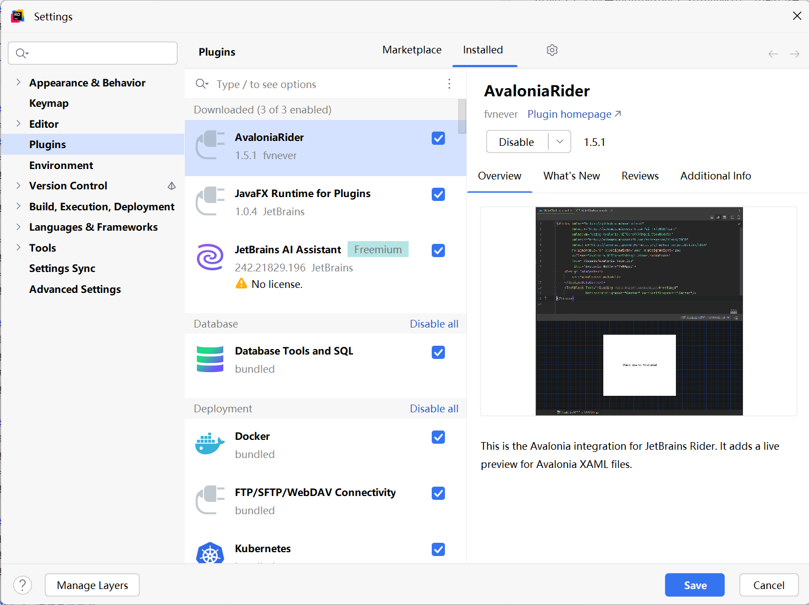

### 功能介绍
本项目是类似百词斩的单词学习桌面应用，功能包括：
### 1. 单词推荐和短句推荐
今日单词推荐页：
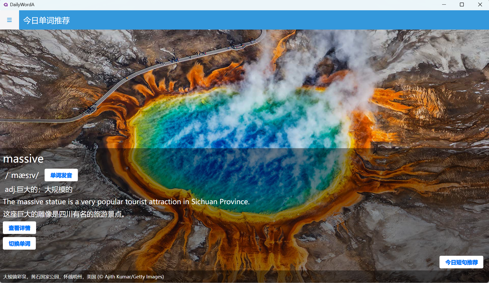
点击“查看详情”会跳转至单词详情页：
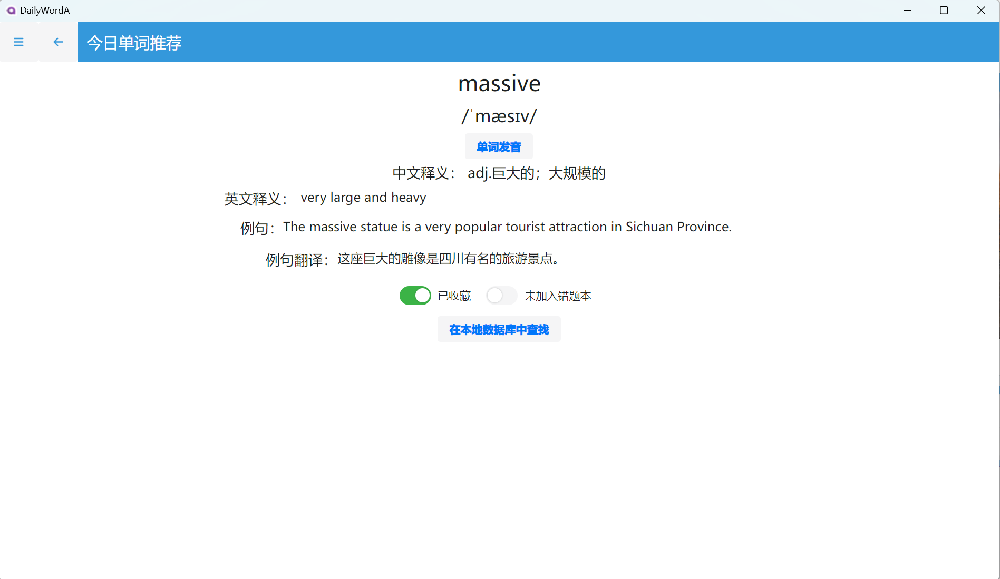

今日格言短句推荐页：

点击“查看详情”会跳转至短句详情页：
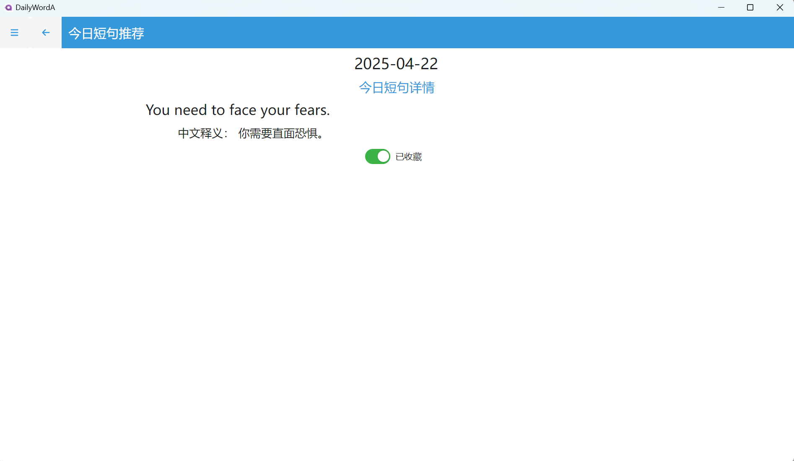

### 2. 单词收藏和短句收藏
单词收藏页（点击任意一条单词会跳转至对应单词的详情页）：
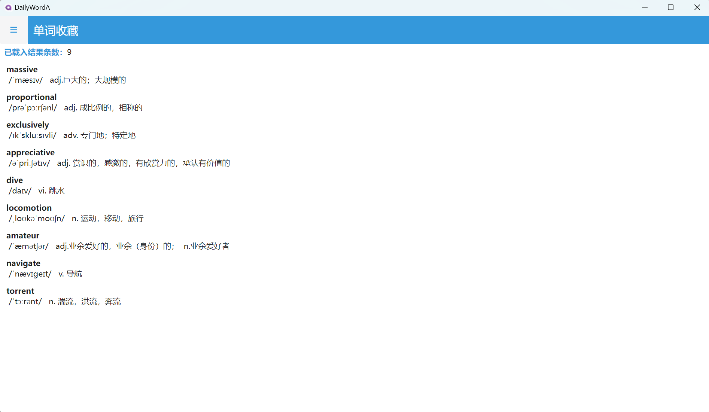
短句收藏页（点击任意一条短句会跳转至对应短句的详情页）：
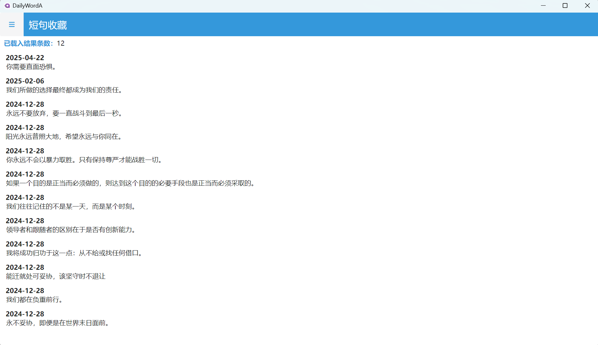

### 3. 单词查找
单词查找页（可选择按英文查找或按中文释义查找，查找方式是字符串模糊查找）：
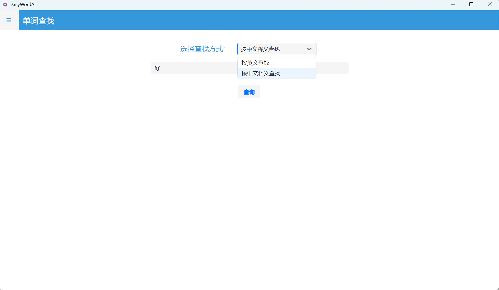
点击查询按钮会跳转至查找结果页面：
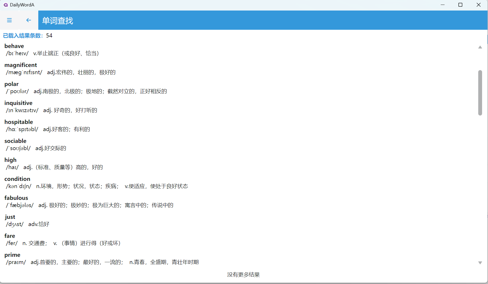

### 4. 文本翻译
调用API进行文本翻译，会自动识别源语言类型，可选择翻译成多种目标语言类型
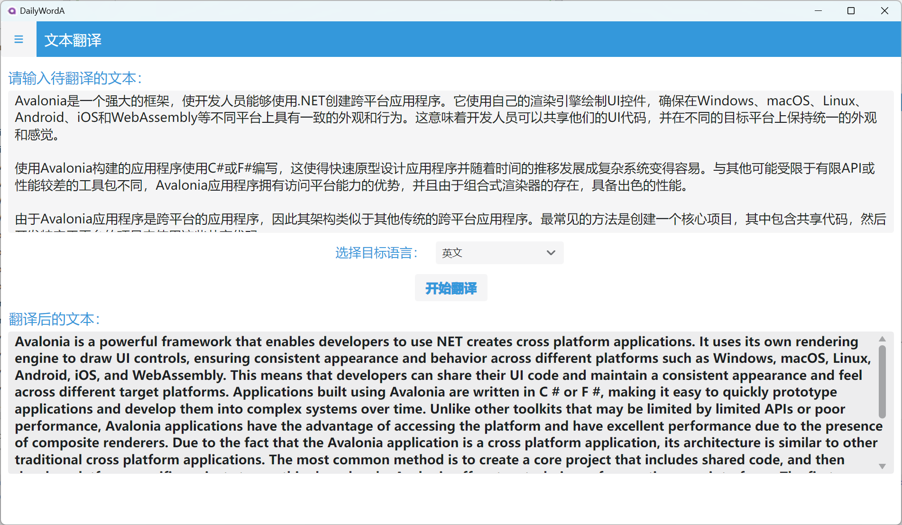
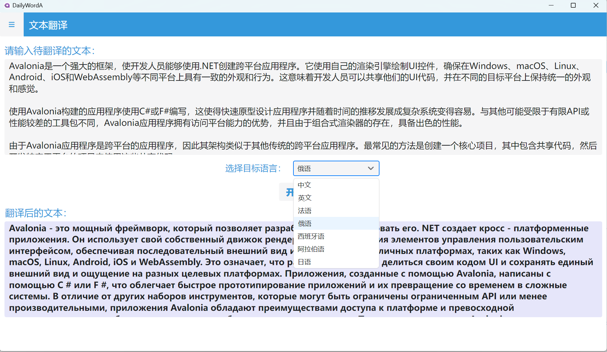

### 5. 多种单词测验
#### (1) 中英选择
有英文选义与中文选词两种模式

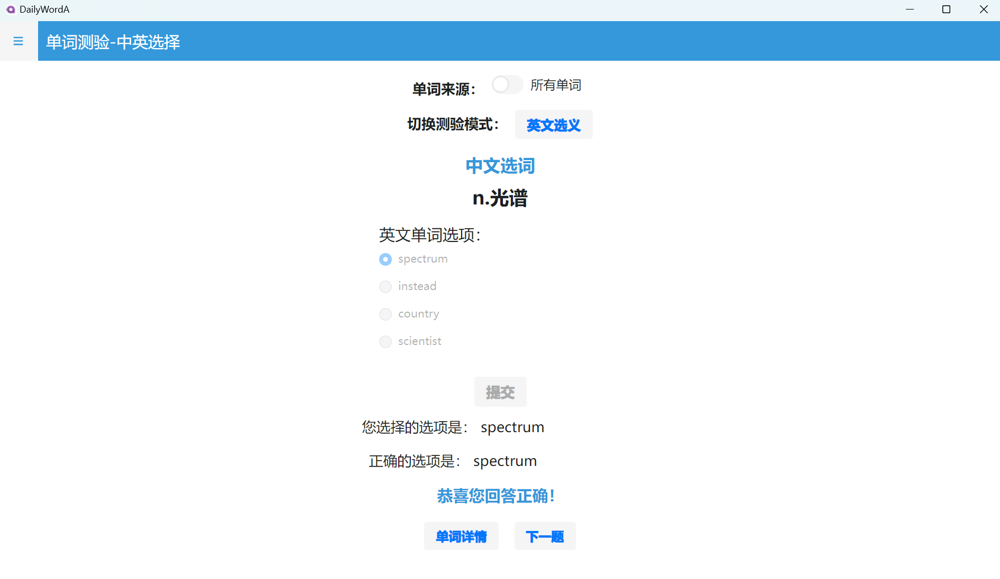

#### (2) 听音写词
点击“单词发音”按钮会调用API播放单词发音的音频，有一定网络延迟；可选择是否显示中文释义
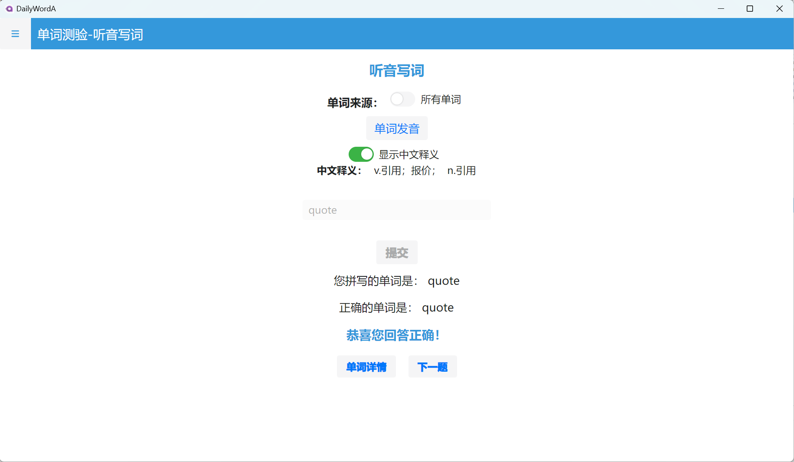

#### (3) 例句填空
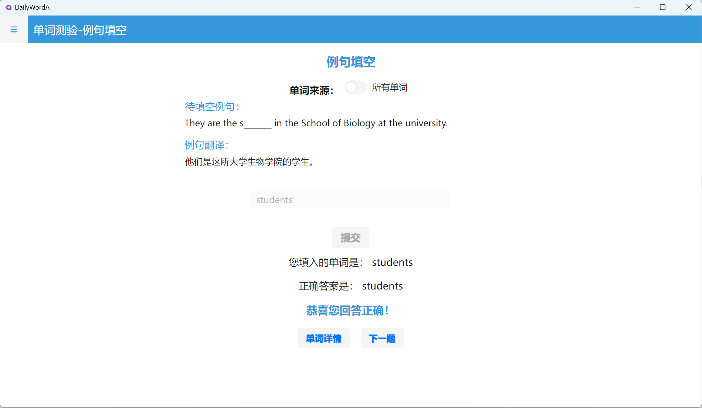

#### (4) Wordle游戏
Wordle是一种单词字谜游戏，每个单词有最多6次猜测机会，根据字母颜色来推测正确的单词：
未在单词中出现的字母为灰色，在单词中出现但位置不对的字母为黄色，位置正确的字母为绿色。
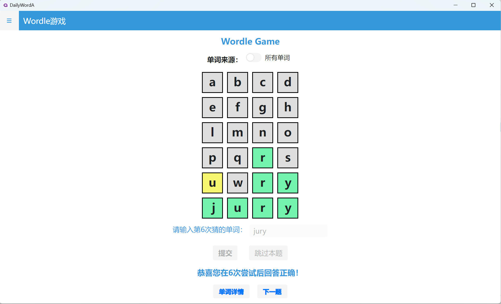

#### (5) 连词成句
按照正确的顺序点击单词，来拼接成正确的句子：
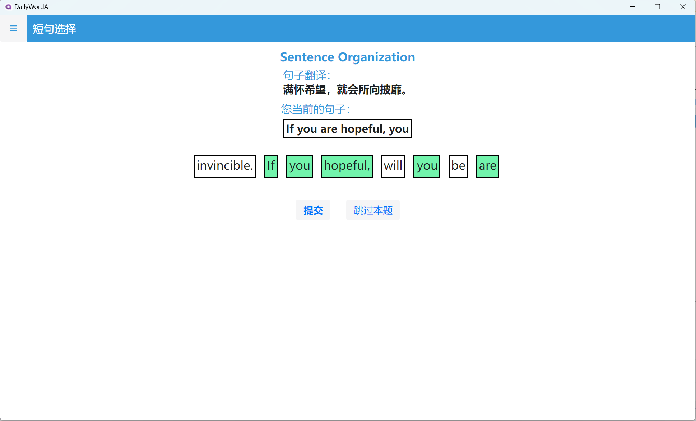
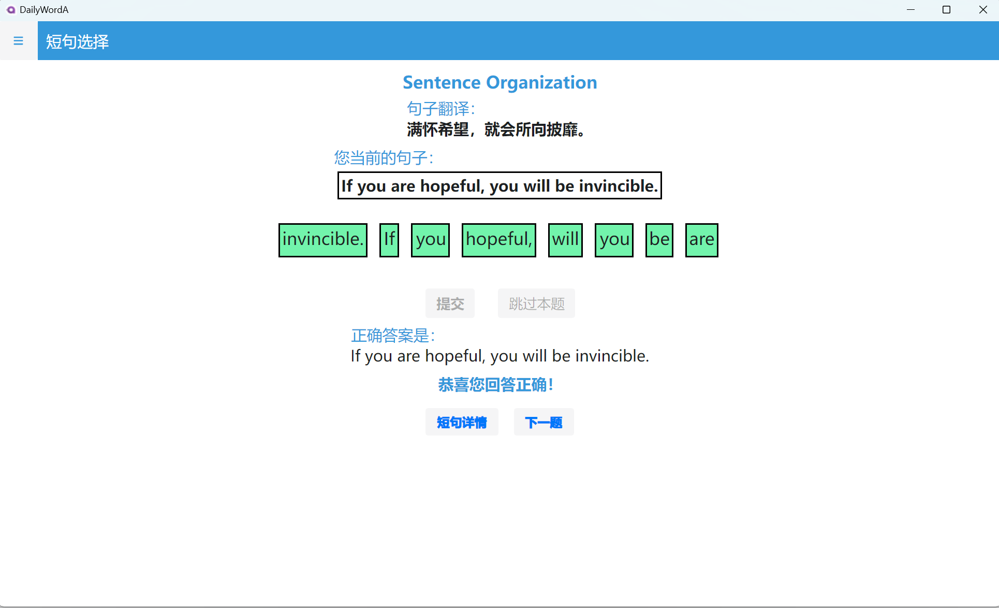

#### (6) 单词错题本
在以上几种单词测验中做错的题目会被自动添加到错题本，点击任意一条单词会跳转至该单词的详情页面；
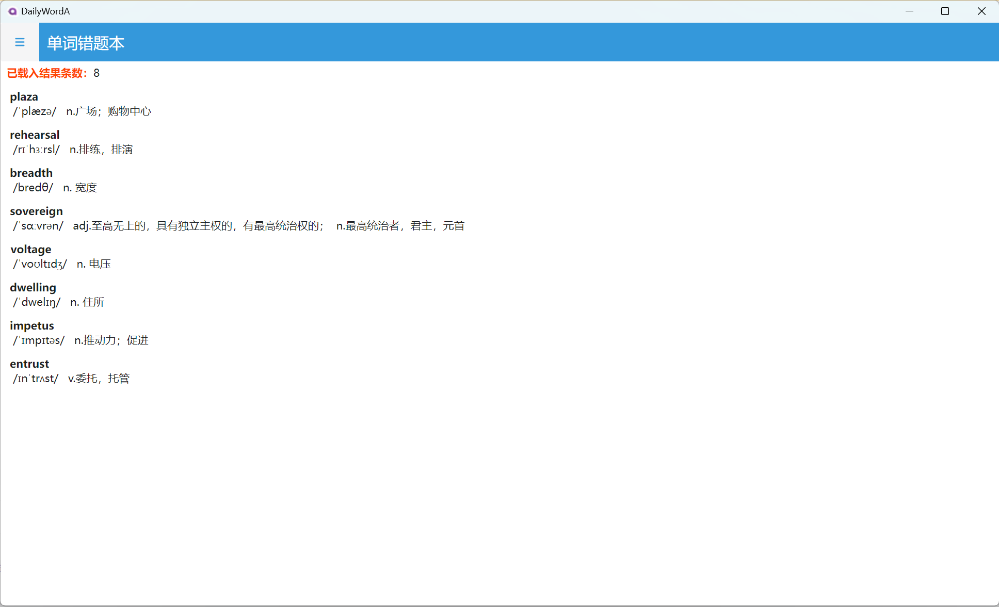
在以上几种单词测验中可将单词来源切换为错题本中的单词，重新做对错题本中的单词后，对应单词会被自动移出错题本。